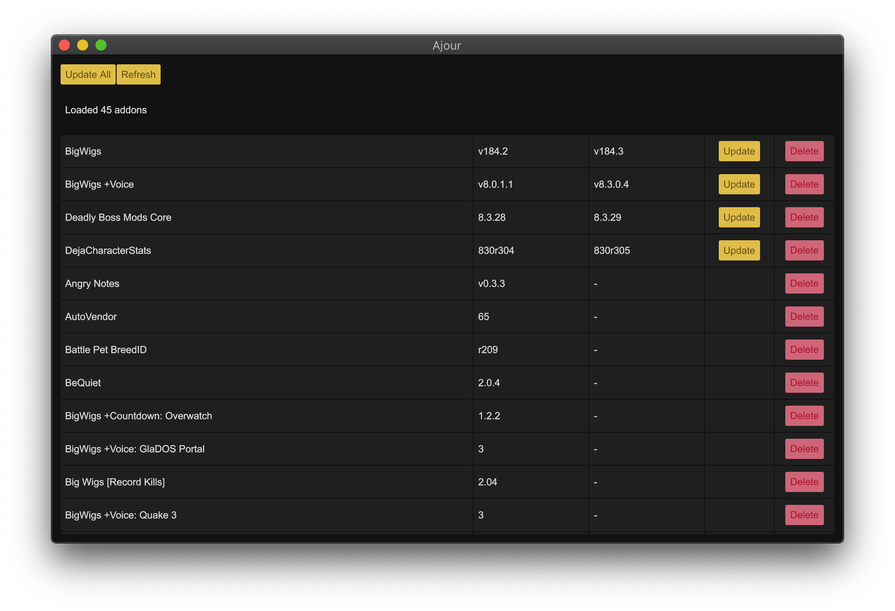

# Ajour
An open source World of Warcraft addon manager written in Rust.  
It is currently in development. Version 1.0 will be ready for [Shadowlands](https://worldofwarcraft.com/en-us/shadowlands). Late 2020.

## Audience
This software is for **Windows** and **MacOS**.  
For **Linux** I would recommend [strongbox](https://github.com/ogri-la/strongbox).

## Build
```
cargo run
```

## Features
- Windows and Mac support
- [TukUI](https://www.tukui.org/) support
- [wowinterface](wowinterface.com) support
- Bulk update
- Delete addon

## Configuration
You can find a template configuration file with documentation for all available fields [here](./ajour.yml).

Ajour doesn't create the config file for you, but it looks for one in the following locations:

* `$HOME/.config/ajour/ajour.yml`
* `$HOME/.ajour.yml`

### Windows
On Windows, the config file should be located at:

* `%APPDATA%\ajour\ajour.yml`

## Screenshots


## Other addon managers
https://ogri-la.github.io/wow-addon-managers/

# License
MIT
