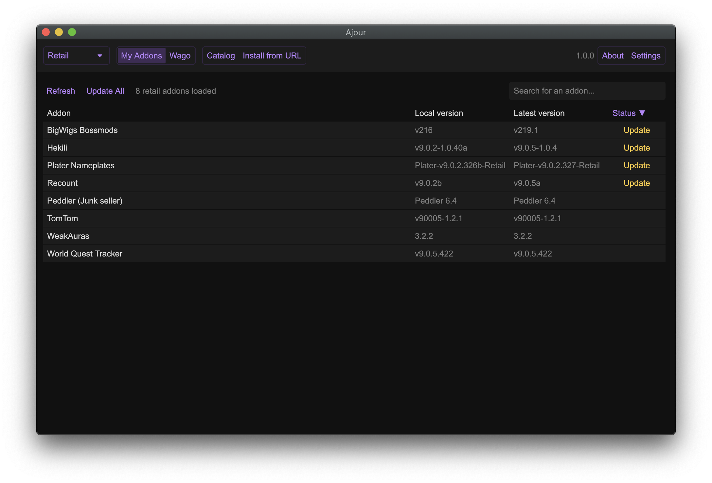
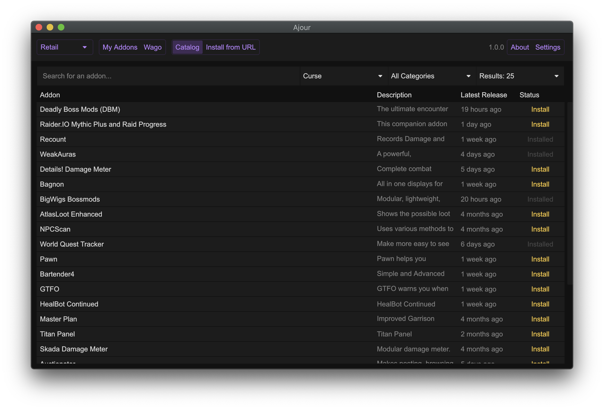

<!-- markdownlint-disable MD004 MD033 -->

# Ajour

## Table of Contents

- [Introduction](#introduction)
- [Screenshots](#screenshots)
- [Features](#features)
- [Install](#install)
- [Themes](#themes)
- [Command Line](#command-line)
- [Contribute](#contribute)
- [FAQ](#faq)
- [Acknowledgement](#acknowledgement)

## Introduction

Ajour is a World of Warcraft addon manager written in Rust with a strong focus
on performance and simplicity. The project is completely advertisement free, privacy
respecting and open source. Ajour currently supports Windows, macOS and Linux.

## Screenshots

  
    

## Features

- Addons will be parsed automatically and resolved from multiple repositories:
  - [Tukui](https://www.tukui.org/)
  - [CurseForge](https://www.curseforge.com/wow/addons)
  - [WoWInterface](https://www.wowinterface.com/)
  - [Townlong Yak](https://www.townlong-yak.com/)
- Install new addons from the catalog or directly from a GitHub/GitLab URL
- Support for release channels, so it's possible to select either `alpha`, `beta`
  or `stable` for each addon
- View changelogs for each addon
- Bulk addon update without any limitations
- Remove addons and their dependencies
- Ignore addons you don't want to update
- Supports both Retail, Classic Era, Classic Tbc, Ptr and Beta versions of
  World of Warcraft
- 10+ handcrafted themes to choose between
  - [Ability to add your own custom themes](#themes)
- Ability to backup your whole UI, including all settings from WTF
- Ability to run as a [command line application](#command-line) for advanced users
- WeakAuras and Plater import strings from [Wago.io](https://wago.io/) will automatically
  be parsed
- Localized in multiple languages

## Install

Prebuilt binaries for macOS and Windows can be downloaded from the [GitHub releases](https://github.com/ajour/ajour/releases)
page.

For everyone else, a detailed instruction can be found [here](https://github.com/ajour/ajour/blob/master/INSTALL.md).

## Themes

Use the [theme builder](http://theme.getajour.com/)
([source](https://github.com/ajour/ajour-theme-builder)) website to quickly
generate custom themes. Once you are done press copy and paste the value into
`Import Theme` inside `Settings` in Ajour.

Custom themes will be saved in this location:

macOS / Linux:

- `$HOME/.config/ajour/themes`

Windows:

- `%APPDATA%\ajour\themes`

## Command Line

Find instructions for using the command line interface [here](./CLI.md)

## Contribute

Ajour wouldn't be here without your help.
I welcome contributions of any kind, because together we can make Ajour even better.

- [Let me know](https://github.com/ajour/ajour/issues/new?assignees=&labels=type%3A+feature&template=feature_request.md&title=)
  if you are missing a vital feature.
- I love [pull requests](https://github.com/ajour/ajour/pulls) and [bug reports](https://github.com/ajour/ajour/issues/new?assignees=&labels=type%3A+bug&template=bug_report.md&title=).
- Don't hesitate to [tell me my Rust programming is bad](https://github.com/ajour/ajour/issues/new)
  but please tell me why.
- Help translating Ajour on [POEditor](https://poeditor.com/join/project?hash=gjghTR7d0Z).
- Join our [Discord server](https://discord.gg/4838t9R) and say hey.

## FAQ

**_macOS won't let me open the app, what should I do?_**

Instead of double clicking it, right click and choose "Open". That should successfully
open Ajour.

**_What requirements does Ajour have?_**

Windows: DX12 or Vulkan
Linux: Vulkan
macOS: Metal

If you are having problems with these requirements, then try the OpenGL build.

**_Where does Ajour store its configuration?_**

Ajour will generate a folder in the following directory:

macOS / Linux:

- `$HOME/.config/ajour`

Windows:

- `%APPDATA%\ajour`

Inside this folder Ajour will keep a configuration file for storing different user
settings, a log file with events from the last session, a fingerprint file with
hashed fingerprints for each addon and a theme folder with custom themes.

**_Why Rust?_**

We wanted to create an application which natively compiles to both Windows, Linux
and macOS while at the same time is as performant and reliable as possible.

## Acknowledgement

- [Rasmus Nielsen](https://rasmusnielsen.dk/) for the Ajour icon.
- [Rune Seir](https://instagram.com/rseir/) for the Ajour banner.

## License

Ajour is released under the [GPL-3.0 License.](https://github.com/ajour/ajour/blob/master/LICENSE)
