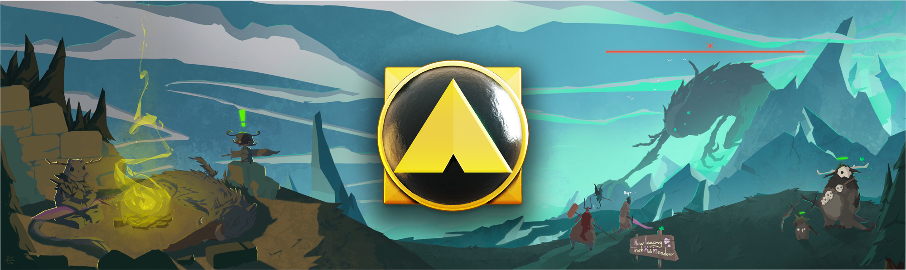
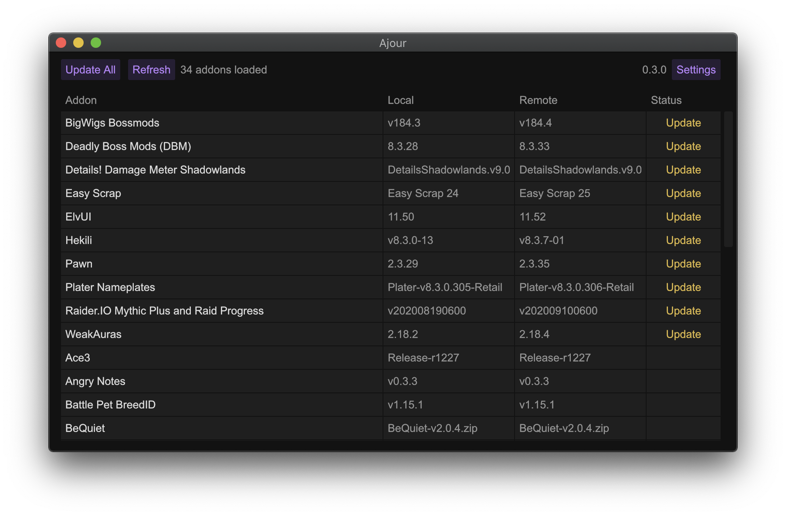
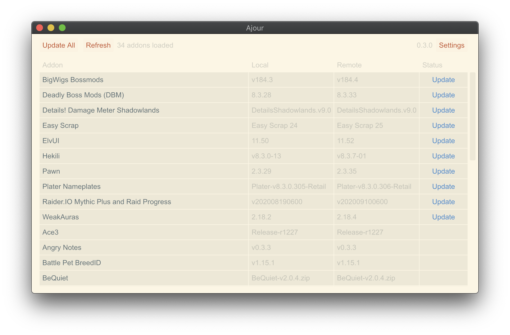

<h1>Ajour</h1>

 

### Table of Contents
- [Introduction](#introduction)
- [Screenshots](#screenshots)
- [Features](#features)
- [Install](#install)
- [Themes](#themes)
- [Command Line](#command-line)
- [Contribute](#contribute)
- [FAQ](#faq)
- [Acknowledgement](#acknowledgement)

## Introduction
Ajour is a World of Warcraft addon manager written in Rust with a strong focus on performance and simplicity. The project is completely advertisement free, privacy respecting and open source. Ajour currently supports Windows, macOS and Linux.

## Screenshots

  
    

## Features

- Addons will be parsed automatically and resolved from multiple repositories:
  - [tukui.org](https://www.tukui.org/)
  - [curse](https://www.curseforge.com/wow/addons)
- Support for release channels, so it's possible to select either `alpha`, `beta` or `stable` for each addon
- View changelogs for each addon 
- Bulk addon update without any limitations
- Remove addons and their dependencies
- Ignore addons you don't want to update
- Supports both Retail, Classic, PTR and Beta versions of World of Warcraft
- 10+ handcrafted themes to choose between
  - [Ability to add your own custom themes](./THEMES.md)
- Ability to backup your whole UI, including all settings from WTF
- Ability to run as a [command line application](#command-line) for advanced users

## Install

Prebuilt binaries for macOS and Windows can be downloaded from the [GitHub releases](https://github.com/casperstorm/ajour/releases) page.

For everyone else, a detailed instruction can be found [here](https://github.com/casperstorm/ajour/blob/master/INSTALL.md).

## Themes

Find instructions for building your own themes [here](./THEMES.md).

## Command Line

Ajour accepts arguments and can even run certain operations on the command line without launching the GUI, such as updating all addons. This makes it possible to manage your addon collection through scripts and scheduling.

You can pass `--help` to see a full list of supported flags, options and commands.

## Contribute

Ajour wouldn't be here without your help.
I welcome contributions of any kind, because together we can make Ajour even better.

+ [Let me know](https://github.com/casperstorm/ajour/issues/new?assignees=&labels=type%3A+feature&template=feature_request.md&title=) if you are missing a vital feature.
+ I love [pull requests](https://github.com/casperstorm/ajour/pulls) and [bug reports](https://github.com/casperstorm/ajour/issues/new?assignees=&labels=type%3A+bug&template=bug_report.md&title=).
+ Don't hesitate to [tell me my Rust programming is bad](https://github.com/casperstorm/ajour/issues/new), but please tell me
  why.
+ Join our [Discord server](https://discord.gg/4838t9R) and say hey.

## FAQ

**_When will you release Ajour / be feature complete?_**

The plan is to have a stable, polished release in time for the Shadowlands launch. 10.27.20.

**_What features are planned?_**

We have a roadmap [here](https://github.com/casperstorm/ajour/projects/2).

**_What should I do if some addon isn't showing or updating correctly?_**

We encourage you to raise an issue and tell us all about it! We want Ajour to support as many addons as possible. This means a lot of edge cases. A list of addons with known issues can be found in the [wiki](https://github.com/casperstorm/ajour/wiki/Addons-with-known-issues).

**_macOS won't let me open the app, what should I do?_**

Instead of double clicking it, right click and choose "Open". That should successfully open Ajour.

**_Where does Ajour store its configuration?_**

Ajour will generate a folder in the following directory:

macOS / Linux:
- `$HOME/.config/ajour`

Windows:

- `%APPDATA%\ajour`

Inside this folder Ajour will keep a configuration file for storing different user settings, a log file with events from the last session, a fingerprint file with hashed fingerprints for each addon and a theme folder with custom themes.

**_Why Rust?_**

We wanted to create an application which natively compiles to both Windows, Linux and macOS while at the same time is as performant and reliable as possible.

## Other addon managers

If Ajour isn't your cup of tea, then [Ogri'la](https://github.com/ogri-la) has done a great job of [cataloguing addon managers](https://ogri-la.github.io/wow-addon-managers/).

## Acknowledgement

- [tarkah](https://github.com/tarkah) for the many great contributions.
- [Rasmus Nielsen](https://rasmusnielsen.dk/) for the Ajour icon.
- [Rune Seir](https://instagram.com/rseir/) for the Ajour banner.
- [mlablah](https://github.com/mlablah) for the architectural discussions.

## License

Ajour is released under the [MIT License.](https://github.com/casperstorm/ajour/blob/master/LICENSE)
