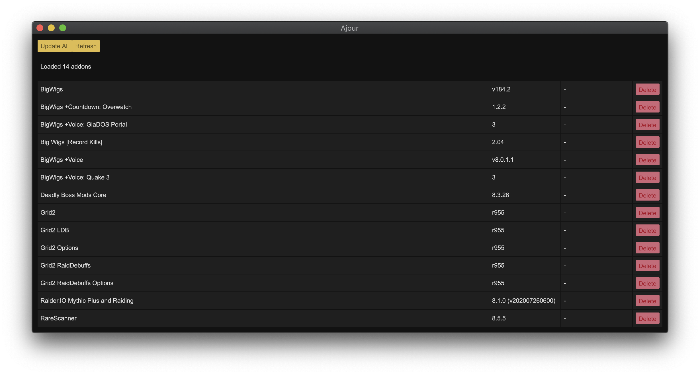

# Ajour
An open source World of Warcraft addon manager written in Rust.

## Build
```
cargo run
```

## Configuration
You can find a template configuration file with documentation for all available fields [here](./ajour.yml).

Ajour doesn't create the config file for you, but it looks for one in the following locations:

* `$HOME/.config/ajour/ajour.yml`
* `$HOME/.ajour.yml`

### Windows
On Windows, the config file should be located at:

* `%APPDATA%\ajour\ajour.yml`

## Screenshots


## Roadmap
Ajour is in the early stages of development.  
Our deadline is to be ready with a working application by the time [Shadowlands](https://worldofwarcraft.com/en-us/shadowlands) launches. Late 2020.  

Our features for version `1.0` will be the following:
- Windows and Mac support
- Bulk update
- Delete an addon

# License
MIT
