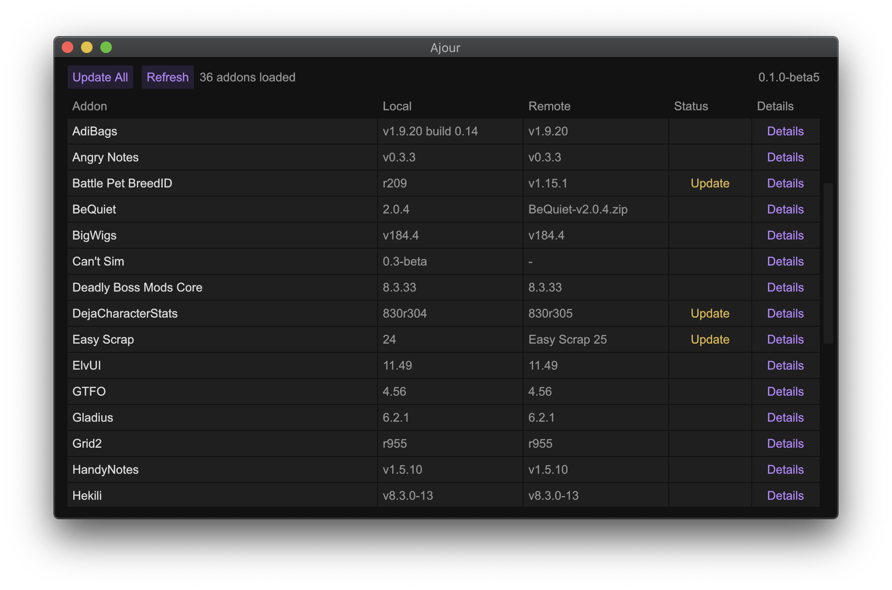

<h1 align="center">Ajour</h1>


Ajour is a World of Warcraft addon manager written in Rust with a strong focus on performance and simplicity. The project is completely advertisement free, privacy respecting and open source. Ajour currently supports macOS and Windows.

<p align="center">
  
</p>


## Features

- Addons from multiple repositories:
  - [wowinterface.com](https://www.wowinterface.com/addons.php)
  - [tukui.org](https://www.tukui.org/)
  - [curse](https://www.curseforge.com/wow/addons)
- Bulk update
- Remove addon
- Retail and classic flavor support

## Install from package

Pre-built packages for Windows and macOS can be found on the [Releases](https://github.com/casperstorm/ajour/releases) page.

## Install from source

On Ubuntu / Debian derivatives, install the following dependencies:

```sh
sudo apt install build-essential cmake libxft-dev libssl-dev libx11-dev
```

To build:

```sh
cargo run
```

If you want to wrap the executable into a OS-specific app package you can use the following:

```sh
# MacOS
make binary
make app
make dmg

# Windows
cargo build --release
```

## Configuration

You can find a template configuration file with documentation for all available fields [here](./ajour.yml).

Ajour looks for a configuration file in the following locations:

- `$HOME/.config/ajour/ajour.yml`
- `$HOME/.ajour.yml`

On Windows, it looks for a config file in the following locations:

- `%APPDATA%\ajour\ajour.yml`
- `In the same directory as the executable`

**Note**: If no configuration file is found, Ajour creates one by itself at the first location specificed. 

## Other addon managers

[Ogri'la](https://github.com/ogri-la) has done a great job of creating a curated list of other addon managers:

https://ogri-la.github.io/wow-addon-managers/

## Acknowledgement

- [Rasmus Nielsen](https://rasmusnielsen.dk/) for the Ajour icon.
- [mlablah](https://github.com/mlablah) for the architectural discussions.
- [##rust and the whole community 🦀](https://webchat.freenode.net/?channels=##rust)

## License

Ajour is released under the [MIT License.](https://github.com/casperstorm/ajour/blob/master/LICENSE)
