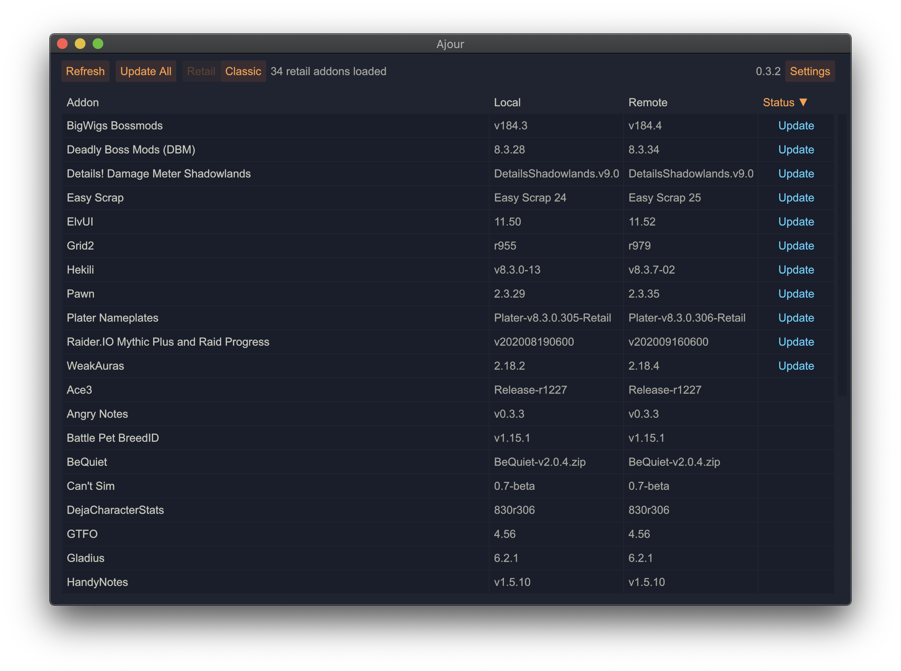
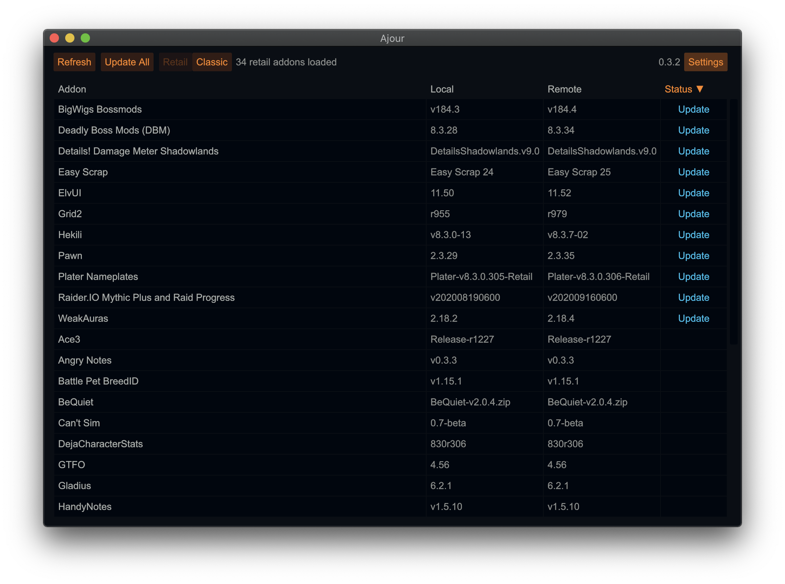
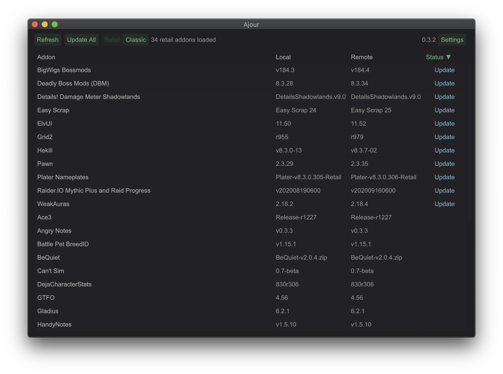
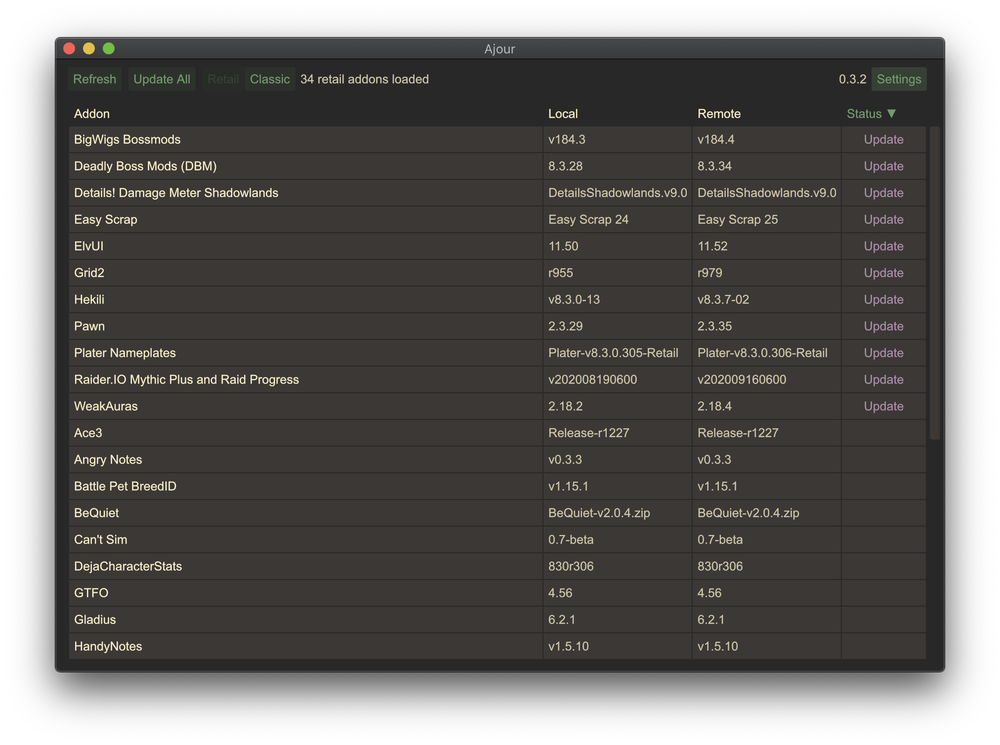
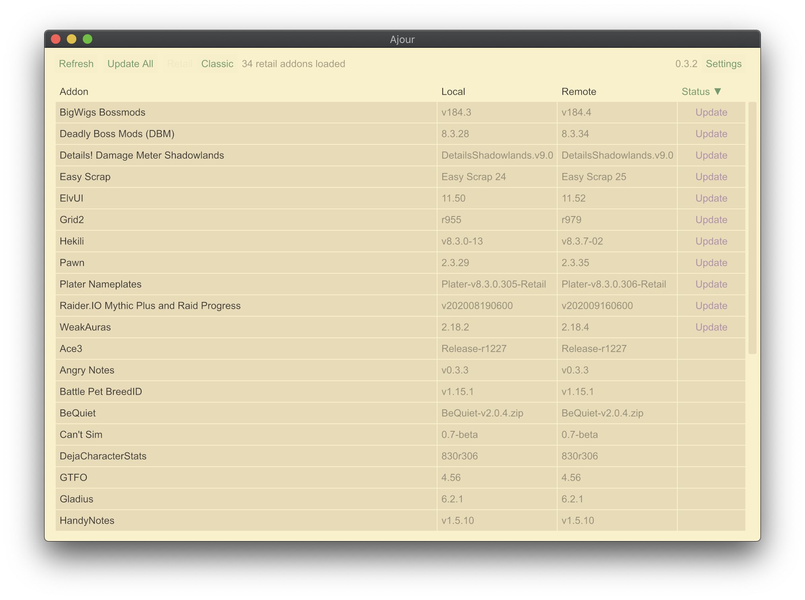
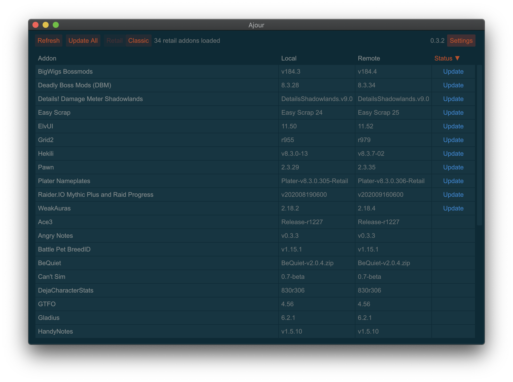
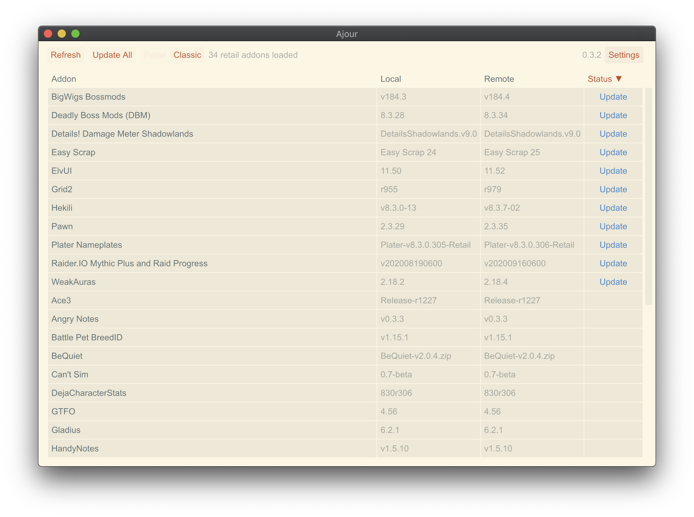
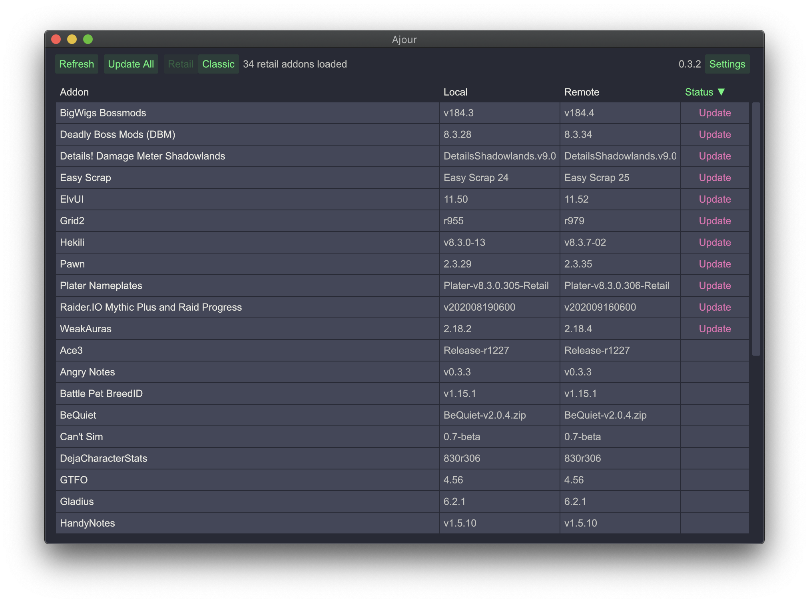
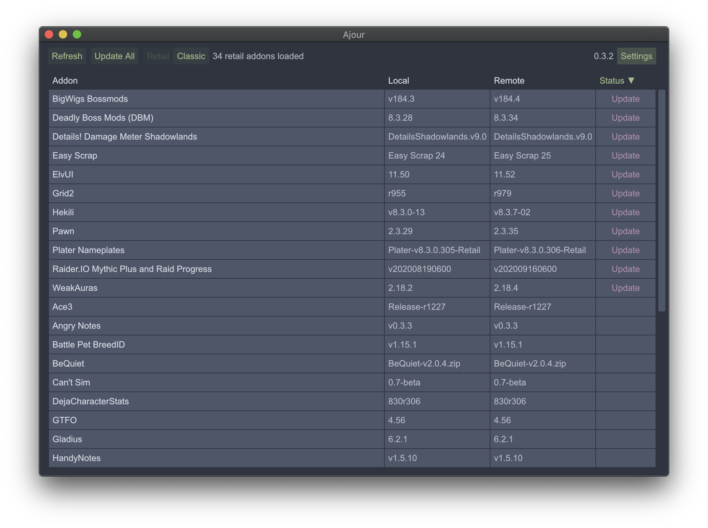
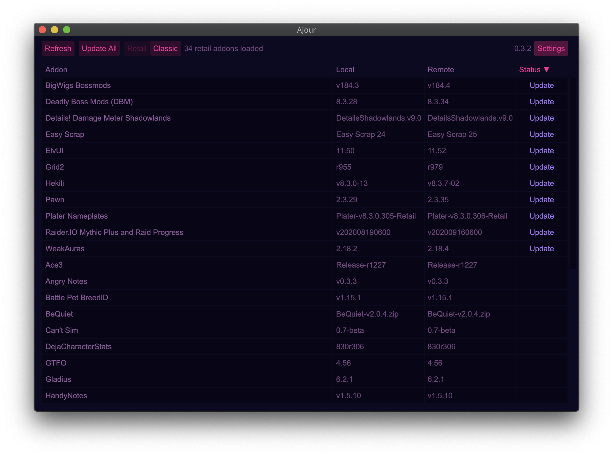

# Themes

Ajour supports custom user generated themes.

To add a new theme, save it as a YAML file. E.g. `example.yml`.

And place it in a folder titled `themes`, in this location:

macOS / Linux:
- `$HOME/.config/ajour/themes`

Windows:
- `%APPDATA%\ajour\themes`

Below are some examples based on popular editor themes.

# [Ayu Mirage](./resources/themes/ayu-mirage.yml)

  

# [Ayu Dark](./resources/themes/ayu-dark.yml)

  

# [Meh](./resources/themes/meh.yml)

  

# [Gruvbox Dark](./resources/themes/gruvbox-dark.yml)

  

# [Gruvbox Light](./resources/themes/gruvbox-light.yml)

  

# [Solarized Dark](./resources/themes/solarized-dark.yml)

  

# [Solarized Light](./resources/themes/solarized-light.yml)

  

# [Dracula](./resources/themes/dracula.yml)

  

# [Nord](./resources/themes/nord.yml)

  

# [Outrun](./resources/themes/outrun.yml)

  

